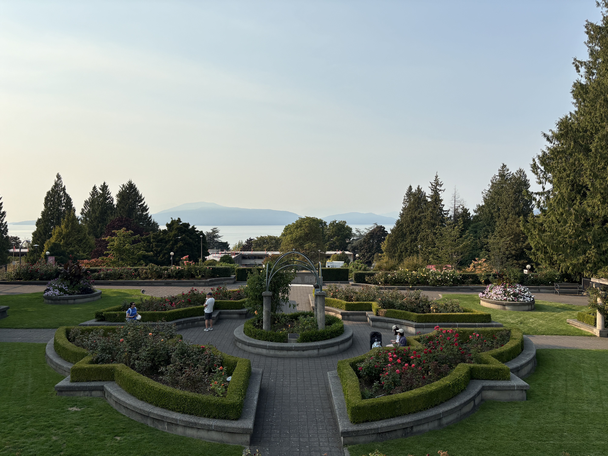

### My First Weeks in MDS

My first week in the MDS program have been exciting and busy. Orientation was a great opportunity to meet my classmates and learn more about the program. There was a lot of new information to take in, but I was excited to start this new chapter and get to know the people I will be studying with over the next year.

The first week of classes was definitely more intense than I expected. We started working with Python, R, Git, GitHub, and the command line very quickly. Coming from a Statistics background at the University of Toronto, I was familiar with R and statistical concepts, but some of the programming tools and workflows were new to me. I was especially surprised by how quickly we moved from learning concepts to actually using them in worksheets and labs.

Now that I have made it through the first two weeks, almost? I am starting to feel more comfortable with the pace and the tools we use. There is still a lot to learn, and sometimes it can feel overwhelming, but I am enjoying the challenge. I am looking forward to improving my programming skills, learning more about data science, and seeing how much I will grow throughout the MDS program.
